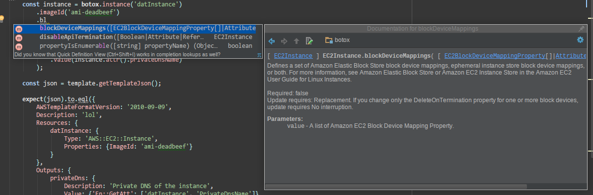

# Botox

A library to programmatically generate [CloudFormation](https://aws.amazon.com/cloudformation/)
templates.

The codebase is 91% autogenerated by scraping the AWS CloudFormation HTML reference documentation:
- [Resources](http://docs.aws.amazon.com/AWSCloudFormation/latest/UserGuide/aws-template-resource-type-ref.html)
- [Property types](http://docs.aws.amazon.com/AWSCloudFormation/latest/UserGuide/aws-product-property-reference.html)
- [Resource attributes](http://docs.aws.amazon.com/AWSCloudFormation/latest/UserGuide/aws-product-attribute-reference.html)

The following documentation was used to create the rest of the code, which was written manually:
- [Intrinsic functions](http://docs.aws.amazon.com/AWSCloudFormation/latest/UserGuide/intrinsic-function-reference.html)
- [Pseudo Parameters](http://docs.aws.amazon.com/AWSCloudFormation/latest/UserGuide/pseudo-parameter-reference.html)
- [cfn-init stuff](http://docs.aws.amazon.com/AWSCloudFormation/latest/UserGuide/aws-resource-init.html)

Since the code base is largely autogenerated, some of the object names are a
little... on the long side. For example, the
[ElasticComputeCloudSpotFleetSpotFleetRequestConfigDataLaunchSpecificationsNetworkInterfacesPrivateIpAddresses](./src/gen/types/ElasticComputeCloudSpotFleetSpotFleetRequestConfigDataLaunchSpecificationsNetworkInterfacesPrivateIpAddresses.js)
property type seems a bit cumbersome in retrospect.

The enormous indexes are also largely autogenerated.

**NOTE: I suggest you that you DO NOT use this library in a production environment. There are approximately
400 files, and they are ALL included as soon as you `require('botox')`. It probably won't
fry your server, but it's a little wasteful for a production environment that cares about performance.**

This library is useful if you want to:
- document parts of your CloudFormation templates (since JSON doesn't allow comments, among other things)
- eliminate duplicated resources, e.g. a subnet in every availability zone can be accomplished using a loop
  instead of copying the same subnet resource multiple times
- write code instead of markup
- not type double quotes, or `Fn::Join` with its copious array arguments

[](https://travis-ci.org/tmont/botox)
[](https://www.npmjs.com/package/botox)

## Installation
```bash
npm install botox
```

## Usage
In the grand spirit of JavaScript libraries, Botox uses a fluent interface so you don't have
to do annoying stuff like type `new`.

If your editor is cool enough, you will get super excellentish intellisense as you type stuff,
which is extraordinarily helpful since unless you're psychotic you're not going to remember the
options for every single resource. It's also very helpful for discovery of resources/options
you might not be aware of.

The easiest way to figure stuff out is to use a cool enough editor and just start typing.
Hopefully your editor is rad and you'll see something that looks like this:



### Example
```javascript
//a portion of the sample template at https://s3.amazonaws.com/cloudformation-templates-us-east-1/WordPress_Multi_AZ.template
const botox = require('botox');

botox.parameter('KeyName')
    .description('Name of an existing EC2 KeyPair to enable SSH access to the instances')
    .type('AWS::EC2::KeyPair::KeyName')
    .constraintDescription('must be the name of an existing EC2 KeyPair.');

const region = botox.region;

const isEc2Vpc = botox.condition('Is-EC2-VPC', botox.or(
    botox.equals(region, 'eu-central-1'),
    botox.equals(region, 'cn-north-1'),
    botox.equals(region, 'ap-northeast-2')
));

const isEc2Classic = botox.condition('Is-EC2-Classic', botox.not(isEc2Vpc));

const lb = botox.loadBalancer('ElasticLoadBalancer')
    .crossZone(true)
    .availabilityZones(botox.getAZs())
    .lbCookieStickinessPolicy([
        botox.elasticLoadBalancingLBCookieStickinessPolicyType()
            .policyName('CookieBasedPolicy')
            .cookieExpirationPeriod('30')
    ])
    .listeners([
        botox.elasticLoadBalancingListenerPropertyType()
            .loadBalancerPort('80')
            .instancePort('80')
            .protocol('HTTP')
            .policyNames([ 'CookieBasedPolicy' ])
    ])
    .healthCheck(botox.elasticLoadBalancingHealthCheckType()
        .target('HTTP:80/')
        .healthyThreshold('2')
        .unhealthyThreshold('5')
        .interval('10')
        .timeout('5')
    );

const template = botox.template('Test template')
    .parameter(keyName)
    .condition(isEc2Vpc)
    .condition(isEc2Classic)
    .resource(lb);

console.log(JSON.stringify(template, null, '  '));
```

This will generate the following:

```json
{
  "AWSTemplateFormatVersion": "2010-09-09",
  "Description": "Test template",
  "Parameters": {
    "KeyName": {
      "Description": "Name of an existing EC2 KeyPair to enable SSH access to the instances",
      "Type": "AWS::EC2::KeyPair::KeyName",
      "ConstraintDescription": "must be the name of an existing EC2 KeyPair."
    }
  },
  "Conditions": {
    "Is-EC2-VPC": {
      "Fn::Or": [
        {
          "Fn::Equals": [
            {
              "Ref": "AWS::Region"
            },
            "eu-central-1"
          ]
        },
        {
          "Fn::Equals": [
            {
              "Ref": "AWS::Region"
            },
            "cn-north-1"
          ]
        },
        {
          "Fn::Equals": [
            {
              "Ref": "AWS::Region"
            },
            "ap-northeast-2"
          ]
        }
      ]
    },
    "Is-EC2-Classic": {
      "Fn::Not": [
        {
          "Condition": "Is-EC2-VPC"
        }
      ]
    }
  },
  "Resources": {
    "ElasticLoadBalancer": {
      "Type": "AWS::ElasticLoadBalancing::LoadBalancer",
      "Properties": {
        "CrossZone": true,
        "AvailabilityZones": {
          "Fn::GetAZs": ""
        },
        "LBCookieStickinessPolicy": [
          {
            "PolicyName": "CookieBasedPolicy",
            "CookieExpirationPeriod": "30"
          }
        ],
        "Listeners": [
          {
            "LoadBalancerPort": "80",
            "InstancePort": "80",
            "Protocol": "HTTP",
            "PolicyNames": [
              "CookieBasedPolicy"
            ]
          }
        ],
        "HealthCheck": {
          "Target": "HTTP:80/",
          "HealthyThreshold": "2",
          "UnhealthyThreshold": "5",
          "Interval": "10",
          "Timeout": "5"
        }
      }
    }
  }
}
```

### Refs
You can also easily get references to resources by using the `.ref` property, e.g.
`lb.ref` would equivalent to `{ "Ref": "ElasticLoadBalancer" }` in the example above.

### Attributes
The equivalent of `Fn::GetAtt` is a property on each resource instance:

```javascript
const instance = botox.instance('datInstance').imageId('ami-deadbeef');
const template = botox.template('lol')
    .resource(instance)
    .output(botox.output('privateDns')
        .description('Private DNS of the instance')
        .value(instance.attr().privateDnsName)
    );
```

```json
{
  "AWSTemplateFormatVersion": "2010-09-09",
  "Description": "lol",
  "Resources": {
    "datInstance": {
      "Type": "AWS::EC2::Instance",
      "Properties": {
        "ImageId": "ami-deadbeef"
      }
    }
  },
  "Outputs": {
    "privateDns": {
      "Description": "Private DNS of the instance",
      "Value": {
        "Fn::GetAtt": [
          "datInstance",
          "PrivateDnsName"
        ]
      }
    }
  }
}
```

### EC2 Instance Initialization (`cfn-init`)
The API for the cfn-init stuff is harder to discover, so here's a brief example:

```javascript
const authName = 'S3Access';
const configs = [
    botox.cfg.config('download')
        .file(botox.cfg.file('/home/ubuntu/.ssh/authorized_keys')
            .authentication(authName)
            .source(botox.join([
                    'https://s3.amazonaws.com',
                    botox.findInMap('buckets', 'prod', 'authBucket'),
                    'authorized_keys'
                ], '/')
            )
            .mode('000600')
            .owner('ubuntu')
            .group('ubuntu')
        ),
    botox.cfg.config('install')
        .package(botox.cfg.package('apt').add('nginx-full'))
];

const instance = botox.instance('datInstance')
    .imageId('ami-deadbeef')
    .cfnAuth(botox.authentication(authName)
        .type('S3')
        .roleName('myRole')
    )
    .cfnInit(botox.cfnInit()
        .configSet('doStuff', configs.map((config) => { return config.name; }))
        .config(configs[0])
        .config(configs[1])
    );

const template = botox.template('lol').resource(instance);

console.log(JSON.stringify(template, null, '  '));
```

which would generate

```json
{
  "AWSTemplateFormatVersion": "2010-09-09",
  "Description": "lol",
  "Resources": {
    "datInstance": {
      "Type": "AWS::EC2::Instance",
      "Properties": {
        "ImageId": "ami-deadbeef"
      },
      "Metadata": {
        "AWS::CloudFormation::Init": {
          "configSets": {
            "doStuff": [
              "download",
              "install"
            ]
          },
          "download": {
            "files": {
              "/home/ubuntu/.ssh/authorized_keys": {
                "authentication": "S3Access",
                "source": {
                  "Fn::Join": [
                    "/",
                    [
                      "https://s3.amazonaws.com",
                      {
                        "Fn::FindInMap": [
                          "buckets",
                          "prod",
                          "authBucket"
                        ]
                      },
                      "authorized_keys"
                    ]
                  ]
                },
                "mode": "000600",
                "owner": "ubuntu",
                "group": "ubuntu"
              }
            }
          },
          "install": {
            "packages": {
              "apt": {
                "nginx-full": []
              }
            }
          }
        },
        "AWS::CloudFormation::Authentication": {
          "S3Access": {
            "type": "S3",
            "roleName": "myRole"
          }
        }
      }
    }
  }
}
```


## Development
- Run tests using `npm test`.
- Lint the generated code using `scripts/lint.sh`.
- Re-scrape CloudFormation docs using `scripts/update.sh`
